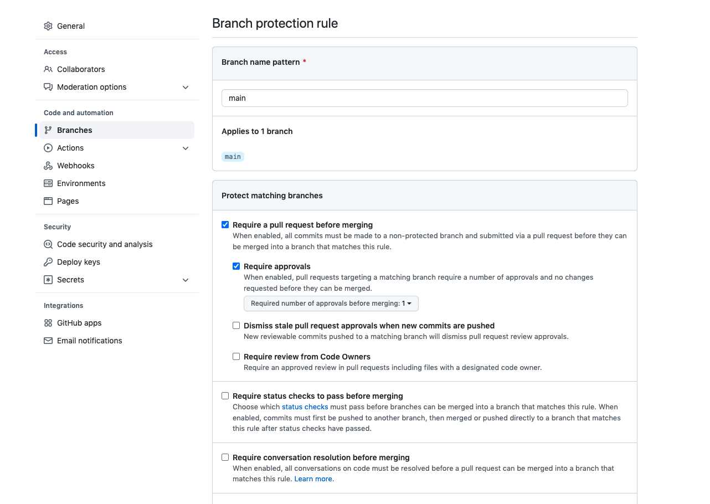
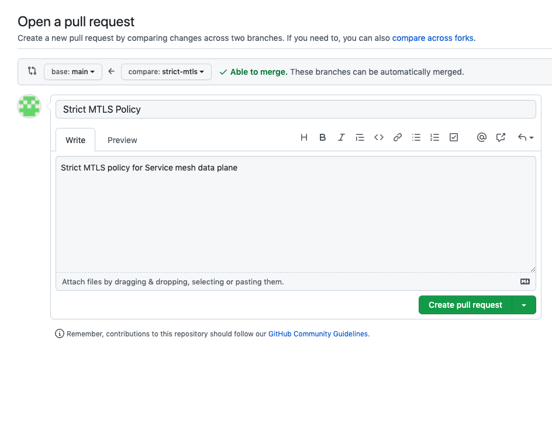
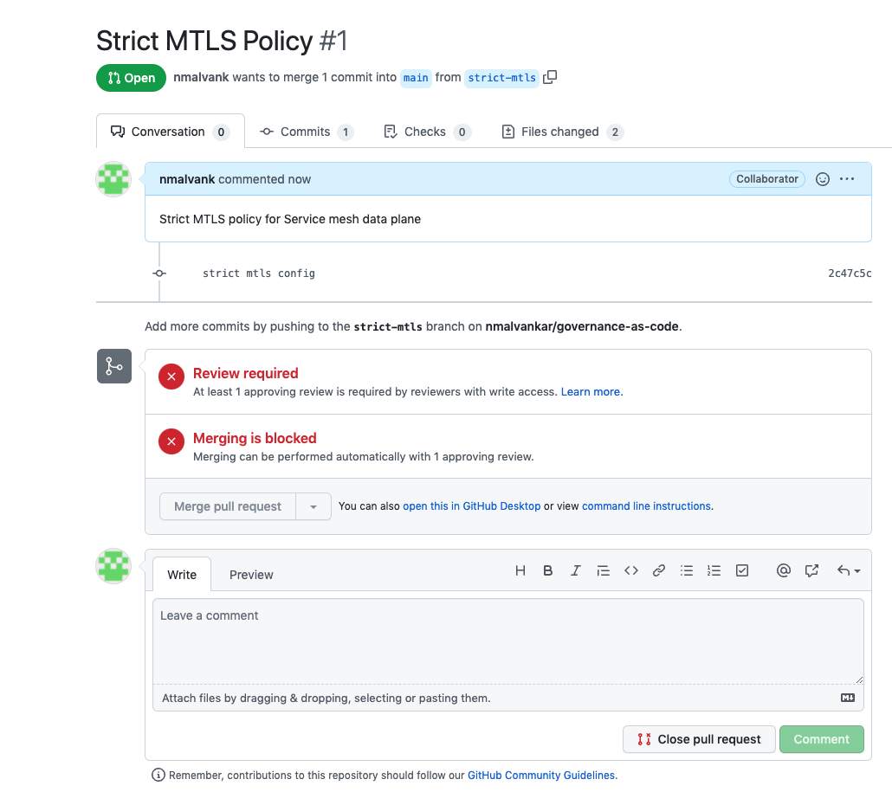
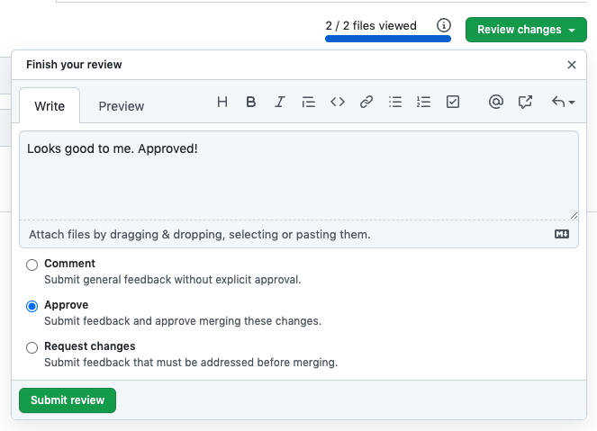
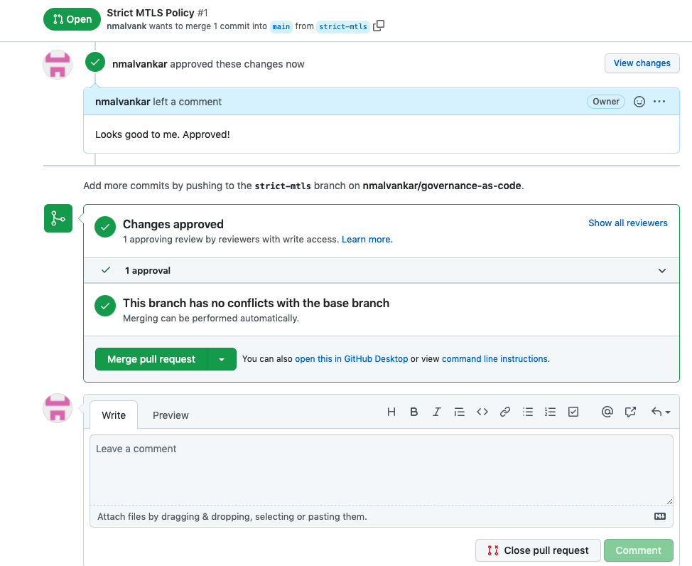

# Governance as Code Demo

### Pre-requisites:
1. OCP 4.x cluster is up and running
2. You have OCP Admin privileges / Role bindings to install the Operators (ElasticSearch, Jaeger, Kiali, OpenShift Service Mesh)
3. [oc](https://access.redhat.com/downloads/content/290/ver=4.9/rhel---8/4.9.21/x86_64/product-software) CLI installed

### Install the OpenShift Service Mesh Control plane
1. Create namespace for the control plane
```
oc new-project istio-system
```

2. Create OSSM control plane with no MTLS for dataplane
```
oc apply -n istio-system -f controlplane.yaml
```

### Install the bookinfo application and add it to the service mesh
1. Create a new namespace to run the bookinfo application
```
oc new-project bookinfo
```

2. Create ServiceMeshMemberRoll resource to add bookinfo namespace to the service mesh
```
oc create -n istio-system -f bookinfo/servicemeshmemberroll-default.yaml
```

3. Verify that the ServiceMeshMemberRoll was created successfully
```
oc get smmr -n istio-system
```

You should see output similar to the following:

```
NAME      READY   STATUS       AGE
default   1/1     Configured   3m22s
```

4. From the CLI, deploy the Bookinfo application in the `bookinfo` project by applying the bookinfo.yaml file
```
oc apply -n bookinfo -f bookinfo/bookinfo.yaml
```

You should see output similar to the following:

```
service/details created
serviceaccount/bookinfo-details created
deployment.apps/details-v1 created
service/ratings created
serviceaccount/bookinfo-ratings created
deployment.apps/ratings-v1 created
service/reviews created
serviceaccount/bookinfo-reviews created
deployment.apps/reviews-v1 created
deployment.apps/reviews-v2 created
deployment.apps/reviews-v3 created
service/productpage created
serviceaccount/bookinfo-productpage created
deployment.apps/productpage-v1 created
```

5. Create the ingress gateway by applying the bookinfo-gateway.yaml file 
```
oc apply -n bookinfo -f bookinfo/bookinfo-gateway.yaml
```

You should see output similar to the following:
```
gateway.networking.istio.io/bookinfo-gateway created
virtualservice.networking.istio.io/bookinfo created
```

6. Set the value for the GATEWAY_URL parameter:
```
export GATEWAY_URL=$(oc -n istio-system get route istio-ingressgateway -o jsonpath='{.spec.host}')
```

7. Add destination rule to use the bookinfo application
```
oc apply -n bookinfo -f bookinfo/destination-rule-all.yaml
```

You should see output similar to the following:
```
destinationrule.networking.istio.io/productpage created
destinationrule.networking.istio.io/reviews created
destinationrule.networking.istio.io/ratings created
destinationrule.networking.istio.io/details created
```

### Verifying the Bookinfo installation
1. Verify that all pods are ready with this command
```
oc get pods -n bookinfo
```

All pods should have a status of Running. You should see output similar to the following:
```
NAME                             READY   STATUS    RESTARTS   AGE
details-v1-86dfdc4b95-fr8hm      2/2     Running   0          12m
productpage-v1-658849bb5-4rcn4   2/2     Running   0          12m
ratings-v1-76b8c9cbf9-wd2nm      2/2     Running   0          12m
reviews-v1-58b8568645-rxrjw      2/2     Running   0          12m
reviews-v2-5d8f8b6775-xhbcs      2/2     Running   0          12m
reviews-v3-666b89cfdf-jms7s      2/2     Running   0          12m
```

2. Run the following command to retrieve the URL for the product page:
```
echo "http://$GATEWAY_URL/productpage"
```

3. Copy and paste the output in a web browser to verify the Bookinfo product page is deployed.

### Setup branch protection for main branch
Setup branch protection for your main branch as shown below



### Create a new branch and push the new policy change
As a collaborator, create a new branch to apply a new policy change and push this branch to the remote git repository
1. Create a new branch locally
```
git checkout -b strict-mtls
```

2. Enable Strict MTLS in the Service Mesh  

   a. Update the content of controlplane.yaml with the following

```
apiVersion: maistra.io/v2
kind: ServiceMeshControlPlane
metadata:
  namespace: istio-system
  name: basic
spec:
  security:
    dataPlane:
      mtls: true
  tracing:
    sampling: 10000
    type: Jaeger
  policy:
    type: Istiod
  addons:
    grafana:
      enabled: true
    jaeger:
      install:
        storage:
          type: Memory
    kiali:
      enabled: true
    prometheus:
      enabled: true
  version: v2.1
  telemetry:
    type: Istiod
```
   b. Enable strict mode by creating a file peerauthentication.yaml with the following content

```
apiVersion: security.istio.io/v1beta1
kind: PeerAuthentication
metadata:
  name: default
  namespace: istio-system
spec:
  mtls:
    mode: STRICT
```

3. Commit and push the new branch to git remote


### Create a Pull request, approve it & merge into the main branch
1. As a collaborator, create a new pull request for the approvers to review the  policy change and approve it



2. As an approver, review the pull request, provide feedback if required and work with the collaborator to close any gaps. 



3. Approve the pull request and merge it with the main branch to trigger the policy change



4. Merge Pull Request



